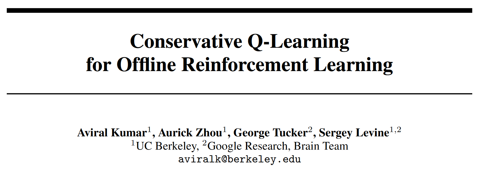

# OfflineRL 1: Conservative Q-Learning

原文链接：[Conservative Q-Learning for Offline Reinforcement Learning](https://proceedings.neurips.cc/paper/2020/file/0d2b2061826a5df3221116a5085a6052-Paper.pdf) NeurIPS 2020

- [OfflineRL 1: Conservative Q-Learning](#offlinerl-1-conservative-q-learning)
  - [Introduction](#introduction)
  - [Preliminaries](#preliminaries)
  - [CQL](#cql)

## Introduction

OfflineRL 这个方向的思路是试图像CV刷ImageNet一样，用过往收集的**大规模数据集**来解决**实际问题**。至于为什么这样就能够解决实际问题，则是因为省略了强化学习的传统技艺——trial-and-error in the environment，也就避免了在诸如 robotics 等方向上的 large cost real-world exploration。很明显，这是比off-policy更彻底的 *off*，是 ***without interaction*** 的，更多关于online/offline, on-policy/off-policy的讨论可以见下文。

[Offline RL 发迹史](./README.md)

回到这篇文章，作者首先指出offlineRL 和标准的 off-pollicy 算法会由于数据集和学习策略之间的**分布偏移  (*distributional shift*)** 导致过估计，特别是在对复杂和多模态数据分布进行训练时，可能会失败。

> offline RL ... , and standard off-policy RL methods can fail due to overestimation of values induced by the distributional shift between the dataset and the learned policy, especially when training on complex and multi-modal data distributions.

因此，为了使值函数的估计不至于过于乐观，本文就提出了 ***conservative Q-learning (CQL)***，旨在通过引入**保守正则项**，使 Q 函数的估计为真实值提供一个下限。因为策略估计和改进通常只使用策略的值，我们可以学习一个不那么保守的下限Q函数，使得只有策略下Q函数的期望是下限的，而不是逐点的下限，否则会出现额外的低估（有证明）。CQL 的核心思想是在适当选择的状态-动作对分布下最小化值函数，然后通过在数据分布上加入最大化项来进一步收紧此边界限制。

> The key idea behind our method is to minimize values under an appropriately chosen distribution over state-action tuples, and then further tighten this bound by also incorporating a maximization term over the data distribution.

从理论上表明，CQL对当前策略的价值产生了下限，并且可以将其纳入具有理论改进保证的策略学习进程中。在实践中，CQL 通过简单的 Q 值正则化器增强了标准的 Bellman 误差目标，该正则化器在现有的深度 Q 学习和行动者批评家实现的基础上直接实现。在离散和连续控制域上，我们发现CQL的表现都大大优于现有的离线RL方法，通常学习的策略可以获得2-5倍以上的最终回报，特别是在从复杂和多模态数据分布中学习时。

## Preliminaries

我们从标准RL模型入手，首先就是一个标准的MDP $(\mathcal{S}, \mathcal{A}, T, r, \gamma)$，对于 off-policy 算法，核心是学习一个参数化的 $Q_\theta(s, a)$ 和/或 $\pi_\phi(a|s)$。

1. **Q-learning-based**: 通过迭代计算贝尔曼最优算子 $\mathcal{B}^{*} Q(\mathbf{s}, \mathbf{a})$ ，并使用精确或近似的最大化方案来训练 Q-function。
   $$
   \mathcal{B}^{*} Q(\mathbf{s}, \mathbf{a})=r(\mathbf{s}, \mathbf{a})+\gamma \mathbb{E}_{\mathbf{s}^{\prime} \sim P\left(\mathbf{s}^{\prime} \mid \mathbf{s}, \mathbf{a}\right)}\left[\max _{\mathbf{a}^{\prime}} Q\left(\mathbf{s}^{\prime}, \mathbf{a}^{\prime}\right)\right]
   $$

2. **Actor-critic-based**: 训练单独的策略以最大化 Q 值，通过迭代 Bellman 运算符 $\mathcal{B}^{\pi} Q$，在通过（部分）策略评估计算 $Q^\pi$ 之间交替，并通过更新策略 $\pi(a|s)$ 来改善策略，使其达到最大化预期Q值的行动
   $$
   \mathcal{B}^{\pi} Q=r+\gamma P^{\pi} Q\\
   P^{\pi} Q(\mathbf{s}, \mathbf{a})=\mathbb{E}_{\mathbf{s}^{\prime} \sim T\left(\mathbf{s}^{\prime} \mid \mathbf{s}, \mathbf{a}\right), \mathbf{a}^{\prime} \sim \pi\left(\mathbf{a}^{\prime} \mid \mathbf{s}^{\prime}\right)}\left[Q\left(\mathbf{s}^{\prime}, \mathbf{a}^{\prime}\right)\right]
   $$

接着是offlineRL要用到的符号：

- $\pi_\beta(\textbf{a}|\textbf{s})$: behavior policy
- $d^{\pi_\beta}(\textbf{s})$: $\pi_\beta(\textbf{a}|\textbf{s})$ 的折扣边际状态分布
- $\mathcal{D}$: dataset sampled from $d^{\pi_\beta}(\textbf{s})\pi_\beta(\textbf{a}|\textbf{s})$
- $\hat{\pi}_\beta(\textbf{a}|\textbf{s})$: empirical behavior policy，$\hat{\pi}_{\beta}(\mathbf{a} \mid \mathbf{s}):=\frac{\sum_{\mathbf{s}, \mathbf{a} \in \mathcal{D}} \mathbf{1}[\mathbf{s}=\mathbf{s}, \mathbf{a}=\mathbf{a}]}{\sum_{\mathbf{s} \in \mathcal{D}} \mathbf{1}[\mathbf{s}=\mathbf{s}]}$ for all state $\textbf{s}\in \mathcal{D}$

由于 $\mathcal{D}$ 通常不包含所有可能的转换 $(\textbf{s}, \textbf{a}, \textbf{s}')$，策略评估步骤实际上使用仅备份单个样本的经验贝尔曼算子 $\hat{\mathcal{B}}^{\pi}$。给定一个数据集 $\mathcal{D}=\{(\textbf{s}, \textbf{a}, \textbf{s}', r)\}$ 来自行为策略 $\pi_\beta$ 下收集的轨迹的元组：
$$
\begin{aligned}
&\hat{Q}^{k+1} \leftarrow \arg \min _{Q} \mathbb{E}_{\mathbf{s}, \mathbf{a}, \mathbf{s}^{\prime} \sim \mathcal{D}}\left[\left(\left(r(\mathbf{s}, \mathbf{a})+\gamma \mathbb{E}_{\mathbf{a}^{\prime} \sim \hat{\pi}^{k}\left(\mathbf{a}^{\prime} \mid \mathbf{s}^{\prime}\right)}\left[\hat{Q}^{k}\left(\mathbf{s}^{\prime}, \mathbf{a}^{\prime}\right)\right]\right)-Q(\mathbf{s}, \mathbf{a})\right)^{2}\right] \text { (policy evaluation) } \\
&\hat{\pi}^{k+1} \leftarrow \arg \max _{\pi} \mathbb{E}_{\mathbf{s} \sim \mathcal{D}, \mathbf{a} \sim \pi^{k}(\mathbf{a} \mid \mathbf{s})}\left[\hat{Q}^{k+1}(\mathbf{s}, \mathbf{a})\right] \quad \text { (policy improvement) }
\end{aligned}
$$
基于此基本配方的离线 RL 算法在训练期间会遭受动作分布偏移 [32,62,29,36]，因为在策略评估中贝尔曼备份的目标值使用从学习策略 πk 中采样的动作，但 Q 函数仅对从产生数据集 D，πβ 的行为策略中采样的动作进行训练。由于 π 被训练为最大化 Q 值，因此它可能偏向于具有错误高 Q 值的分布外 (OOD) 动作。在标准 RL 中，可以通过尝试在环境中执行操作并观察其实际值来纠正此类错误。然而，由于无法与环境交互，因此在离线 RL 中处理 OOD 动作的 Q 值变得具有挑战性。典型的离线 RL 方法 [32、29、62、57] 通过将学习策略 [36] 限制在 OOD 动作之外来缓解这个问题。请注意，离线 RL 中的 Q 函数训练不会受到状态分布偏移的影响，因为 Bellman 备份从不查询分布外状态的 Q 函数。但是，该策略可能会在测试时受到状态分布变化的影响。

## CQL

Q值的下限可防止离线RL设置中常见的高估，这是由于OOD操作和函数近似误差引起的[36，32]。我们使用术语CQL来广泛指代Q学习方法和演员批评方法，尽管后者也使用明确的策略。

### Conservative Off-Policy Evaluation

### Conservative Q-Learning for Offline RL

### Safe Policy Improvement Guarantees
