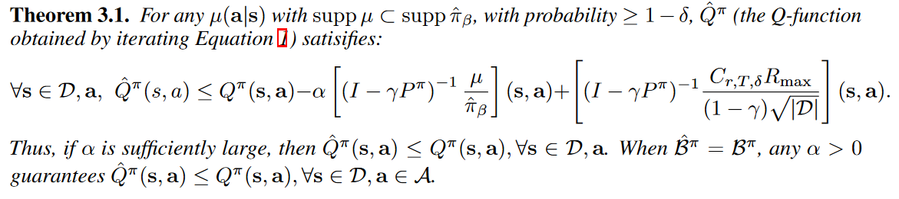
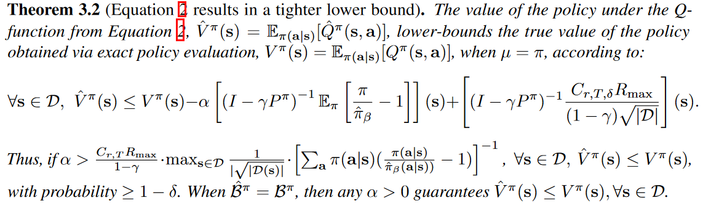
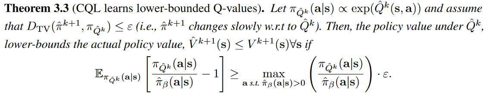

# OfflineRL 1: Conservative Q-Learning

原文链接：[Conservative Q-Learning for Offline Reinforcement Learning](https://proceedings.neurips.cc/paper/2020/file/0d2b2061826a5df3221116a5085a6052-Paper.pdf) NeurIPS 2020

- [OfflineRL 1: Conservative Q-Learning](#offlinerl-1-conservative-q-learning)
  - [Introduction](#introduction)
  - [Preliminaries](#preliminaries)
  - [CQL](#cql)

## Introduction

OfflineRL 这个方向的思路是试图像CV刷ImageNet一样，用过往收集的**大规模数据集**来解决**实际问题**。至于为什么这样就能够解决实际问题，则是因为省略了强化学习的传统技艺——trial-and-error in the environment，也就避免了在诸如 robotics 等方向上的 large cost real-world exploration。很明显，这是比off-policy更彻底的 *off*，是 ***without interaction*** 的，更多关于online/offline, on-policy/off-policy的讨论可以见下文。

[Offline RL 发迹史](./README.md)

回到这篇文章，作者首先指出offlineRL 和标准的 off-pollicy 算法会由于数据集和学习策略之间的**分布偏移  (*distributional shift*)** 导致过估计，特别是在对复杂和多模态数据分布进行训练时，可能会失败。

> offline RL ... , and standard off-policy RL methods can fail due to overestimation of values induced by the distributional shift between the dataset and the learned policy, especially when training on complex and multi-modal data distributions.

因此，为了使值函数的估计不至于过于乐观，本文就提出了 ***conservative Q-learning (CQL)***，旨在通过引入**保守正则项**，使 Q 函数的估计为真实值提供一个下限。因为策略估计和改进通常只使用策略的值，我们可以学习一个不那么保守的下限Q函数，使得只有策略下Q函数的期望是下限的，而不是逐点的下限，否则会出现额外的低估（有证明）。CQL 的核心思想是在适当选择的状态-动作对分布下最小化值函数，然后通过在数据分布上加入最大化项来进一步收紧此边界限制。

> The key idea behind our method is to minimize values under an appropriately chosen distribution over state-action tuples, and then further tighten this bound by also incorporating a maximization term over the data distribution.

从理论上表明，CQL对当前策略的价值产生了下限，并且可以将其纳入具有理论改进保证的策略学习进程中。在实践中，CQL 通过简单的 Q 值正则化器增强了标准的 Bellman 误差目标，该正则化器在现有的深度 Q 学习和行动者批评家实现的基础上直接实现。在离散和连续控制域上，我们发现CQL的表现都大大优于现有的离线RL方法，通常学习的策略可以获得2-5倍以上的最终回报，特别是在从复杂和多模态数据分布中学习时。

## Preliminaries

我们从标准RL模型入手，首先就是一个标准的MDP $(\mathcal{S}, \mathcal{A}, T, r, \gamma)$，对于 off-policy 算法，核心是学习一个参数化的 $Q_\theta(s, a)$ 和/或 $\pi_\phi(a|s)$。

1. **Q-learning-based**: 通过迭代计算贝尔曼最优算子 $\mathcal{B}^{*} Q(\mathbf{s}, \mathbf{a})$ ，并使用精确或近似的最大化方案来训练 Q-function。
   $$
   \mathcal{B}^{*} Q(\mathbf{s}, \mathbf{a})=r(\mathbf{s}, \mathbf{a})+\gamma \mathbb{E}_{\mathbf{s}^{\prime} \sim P\left(\mathbf{s}^{\prime} \mid \mathbf{s}, \mathbf{a}\right)}\left[\max _{\mathbf{a}^{\prime}} Q\left(\mathbf{s}^{\prime}, \mathbf{a}^{\prime}\right)\right]
   $$

2. **Actor-critic-based**: 训练单独的策略以最大化 Q 值，通过迭代 Bellman 运算符 $\mathcal{B}^{\pi} Q$，在通过（部分）策略评估计算 $Q^\pi$ 之间交替，并通过更新策略 $\pi(a|s)$ 来改善策略，使其达到最大化预期Q值的行动
   $$
   \mathcal{B}^{\pi} Q=r+\gamma P^{\pi} Q\\
   P^{\pi} Q(\mathbf{s}, \mathbf{a})=\mathbb{E}_{\mathbf{s}^{\prime} \sim T\left(\mathbf{s}^{\prime} \mid \mathbf{s}, \mathbf{a}\right), \mathbf{a}^{\prime} \sim \pi\left(\mathbf{a}^{\prime} \mid \mathbf{s}^{\prime}\right)}\left[Q\left(\mathbf{s}^{\prime}, \mathbf{a}^{\prime}\right)\right]
   $$

接着是offlineRL要用到的符号：

- $\pi_\beta(\textbf{a}|\textbf{s})$: behavior policy
- $d^{\pi_\beta}(\textbf{s})$: $\pi_\beta(\textbf{a}|\textbf{s})$ 的折扣边际状态分布
- $\mathcal{D}$: dataset sampled from $d^{\pi_\beta}(\textbf{s})\pi_\beta(\textbf{a}|\textbf{s})$
- $\hat{\pi}_\beta(\textbf{a}|\textbf{s})$: empirical behavior policy，$\hat{\pi}_{\beta}(\mathbf{a} \mid \mathbf{s}):=\frac{\sum_{\mathbf{s}, \mathbf{a} \in \mathcal{D}} \mathbf{1}[\mathbf{s}=\mathbf{s}, \mathbf{a}=\mathbf{a}]}{\sum_{\mathbf{s} \in \mathcal{D}} \mathbf{1}[\mathbf{s}=\mathbf{s}]}$ for all state $\textbf{s}\in \mathcal{D}$

由于 $\mathcal{D}$ 通常不包含所有可能的转换 $(\textbf{s}, \textbf{a}, \textbf{s}')$，策略评估步骤实际上使用仅备份单个样本的经验贝尔曼算子 $\hat{\mathcal{B}}^{\pi}$。给定一个数据集 $\mathcal{D}=\{(\textbf{s}, \textbf{a}, \textbf{s}', r)\}$ 来自行为策略 $\pi_\beta$ 下收集的轨迹的元组：
$$
\begin{aligned}
&\hat{Q}^{k+1} \leftarrow \arg \min _{Q} \mathbb{E}_{\mathbf{s}, \mathbf{a}, \mathbf{s}^{\prime} \sim \mathcal{D}}\left[\left(\left(r(\mathbf{s}, \mathbf{a})+\gamma \mathbb{E}_{\mathbf{a}^{\prime} \sim \hat{\pi}^{k}\left(\mathbf{a}^{\prime} \mid \mathbf{s}^{\prime}\right)}\left[\hat{Q}^{k}\left(\mathbf{s}^{\prime}, \mathbf{a}^{\prime}\right)\right]\right)-Q(\mathbf{s}, \mathbf{a})\right)^{2}\right] \text { (policy evaluation) } \\
&\hat{\pi}^{k+1} \leftarrow \arg \max _{\pi} \mathbb{E}_{\mathbf{s} \sim \mathcal{D}, \mathbf{a} \sim \pi^{k}(\mathbf{a} \mid \mathbf{s})}\left[\hat{Q}^{k+1}(\mathbf{s}, \mathbf{a})\right] \quad \text { (policy improvement) }
\end{aligned}
$$
基于此基本配方的离线 RL 算法在训练期间会遭受动作分布偏移 [32,62,29,36]，因为在策略评估中贝尔曼备份的目标值使用从学习策略 πk 中采样的动作，但 Q 函数仅对从产生数据集 D，πβ 的行为策略中采样的动作进行训练。由于 π 被训练为最大化 Q 值，因此它可能偏向于具有错误高 Q 值的分布外 (OOD) 动作。在标准 RL 中，可以通过尝试在环境中执行操作并观察其实际值来纠正此类错误。然而，由于无法与环境交互，因此在离线 RL 中处理 OOD 动作的 Q 值变得具有挑战性。典型的离线 RL 方法 [32、29、62、57] 通过将学习策略 [36] 限制在 OOD 动作之外来缓解这个问题。请注意，离线 RL 中的 Q 函数训练不会受到状态分布偏移的影响，因为 Bellman 备份从不查询分布外状态的 Q 函数。但是，该策略可能会在测试时受到状态分布变化的影响。

## CQL

Q值的下限可防止离线RL设置中常见的高估，这是由于OOD操作和函数近似误差引起的[36，32]。我们使用术语CQL来广泛指代Q学习方法和演员批评方法，尽管后者也使用明确的策略。

### Conservative Off-Policy Evaluation

我们的目标是利用通过 behavior policy  $\pi_\beta(\textbf{a}|\textbf{s})$ 生成的数据集 $\mathcal{D}$ 来估计 target policy $\pi$ 的值 $V^\pi(\textbf{s})$。上文所提到的保守正则项是通过在标准贝尔曼损失的基础上，加上一个最小化 $Q$ 值项来得到 $Q$ 函数的下限。具体来说是在状态-动作对的特定分布 $μ(\textbf{s}, \textbf{a})$ 下，最小化期望 $Q$ 值。由于标准 $Q$ 函数训练不会在未观察到的 state 下查询 *Q* 函数值，而是在未观察到的 action 下查询 Q 函数，因此将 $μ$ 限制为数据集中的状态边际，使得 $μ(\textbf{s}, \textbf{a})=d^{\pi_\beta}(\textbf{s})\mu(\textbf{a}|\textbf{s})$。那么，就有了如下的 basic CQL，其学习到的 $Q$ 函数可以作为真实 $Q$ 函数的下界：
$$
\label{4}
\hat{Q}^{k+1} \leftarrow \arg \min _{Q} {\color{brown}\alpha \mathbb{E}_{\mathbf{s} \sim \mathcal{D}, \mathbf{a} \sim \mu(\mathbf{a} \mid \mathbf{s})}[Q(\mathbf{s}, \mathbf{a})]}+\frac{1}{2} \mathbb{E}_{\mathbf{s}, \mathbf{a} \sim \mathcal{D}}\left[\left(Q(\mathbf{s}, \mathbf{a})-\hat{\mathcal{B}}^{\pi} \hat{Q}^{k}(\mathbf{s}, \mathbf{a})\right)^{2}\right]
$$
但是，如果我们只对估计 $V^\pi$ 感兴趣，我们可以大大收紧这个界限。如果只要求 $\pi(\textbf{a}|\textbf{s})$ 下，期望 $\hat Q^\pi$ 能够代表 $V^\pi$ 的下限，可以通过在数据分布下引入一个额外的 $Q$ 值最大化项 $\pi_\beta(\textbf{a}|\textbf{s})$ 来改善边界，从而为策略 $\pi$ 的期望 $Q$ 值提供更严格的下限：
$$
\begin{equation}\label{5}
\begin{aligned}
\hat{Q}^{k+1} \leftarrow \arg \min _{Q} \alpha \cdot\left(\mathbb{E}_{\mathbf{s} \sim \mathcal{D}, \mathbf{a} \sim \mu(\mathbf{a} \mid \mathbf{s})}[Q(\mathbf{s}, \mathbf{a})]\right.&\left.-{\color{red}{\mathbb{E}_{\mathbf{s} \sim \mathcal{D}, \mathbf{a} \sim \hat{\pi}_{\beta}(\mathbf{a} \mid \mathbf{s})}[Q(\mathbf{s}, \mathbf{a})]}}\right) \\
&+\frac{1}{2} \mathbb{E}_{\mathbf{s}, \mathbf{a}, \mathbf{s}^{\prime} \sim \mathcal{D}}\left[\left(Q(\mathbf{s}, \mathbf{a})-\hat{\mathcal{B}}^{\pi} \hat{Q}^{k}(\mathbf{s}, \mathbf{a})\right)^{2}\right] .
\end{aligned}
\end{equation}
$$
由于公式 5 在  behavior policy $\hat\pi_\beta$ 下最大化 $Q$ 值，因此在该策略下的动作的 $Q$ 值可能被高估，即 $\hat Q^\pi$  可能不会逐点下限 $Q^\pi$。虽然原则上，最大化项可以利用 $\hat{\pi}_\beta(\textbf{a}|\textbf{s})$ 以外的其他分布，但我们在附录 D.2 中证明，所得值不能保证是  $\hat{\pi}_\beta(\textbf{a}|\textbf{s})$ 以外的其他分布的下限。

#### Theoretical analysis

公式 $\eqref{4}$ 和 $\eqref{5}$ 使用的是经验贝尔曼算子 $\hat{\mathcal{B}}^\pi$，而不是实际的贝尔曼算子 ${\mathcal{B}}^\pi$

首先证明，通过迭代公式 $\eqref{4}$ 学到的保守Q函数为真正的Q函数的下界

其次是展示公式 $\eqref{5}$ 在 $μ = π$的情况下，为策略 $π$ 下期望 $Q$ 值的下限。且公式 $\eqref{5}$ 不会逐点下限 $Q$ 估计值。对于这个结果，我们滥用符号，并假设1√|D|指仅状态计数的平方根反比向量，具有与以前类似的校正，用于在计数为零的状态下处理此向量的条目。

上面给出的分析假设 $Q$ 函数中没有使用函数近似，这意味着每个迭代都可以精确表示。我们可以将定理3.2中的结果进一步推广到线性函数逼近器和非线性神经网络函数逼近器的情况下，后者建立在神经切线核（NTK）框架上。

### Conservative Q-Learning for Offline RL

利用上述思想即可以构成本文所提出的 CQL，一种通用的离线策略学习方法。

我们可以在对每个策略迭代执行完全的 off-policy  评估（πk）和策略改进的一个步骤之间进行交替。但是，这在计算上可能很昂贵。或者，由于策略  $\hat{\pi}^k$ 通常派生自 $Q$  函数，因此我们可以选择 $\mu(\mathbf{a} \mid \mathbf{s})$  来近似策略，从而最大化当前 Q 函数迭代，产生在线算法。具体来说，通过定义针对 $\mu(\mathbf{a} \mid \mathbf{s})$ 的优化问题来实现此类在线算法。该系列的实例由 CQL ($\mathcal{R}$) 表示，其特征在于正则化器 R（μ） 的特定选择：

- CQL ($\mathcal{R}$)

$$
\label{6}
\begin{aligned}
\min _{Q} {\color{red}\max _{\mu}} &\alpha\left(\mathbb{E}_{\mathbf{s} \sim \mathcal{D}, \mathbf{a} \sim \mu(\mathbf{a} \mid \mathbf{s})}[Q(\mathbf{s}, \mathbf{a})]-\mathbb{E}_{\mathbf{s} \sim \mathcal{D}, \mathbf{a} \sim \hat{\pi}_{\beta}(\mathbf{a} \mid \mathbf{s})}[Q(\mathbf{s}, \mathbf{a})]\right) \\
&+\frac{1}{2} \mathbb{E}_{\mathbf{s}, \mathbf{a}, \mathbf{s}^{\prime} \sim \mathcal{D}}\left[\left(Q(\mathbf{s}, \mathbf{a})-\hat{\mathcal{B}}^{\pi_{k}} \hat{Q}^{k}(\mathbf{s}, \mathbf{a})\right)^{2}\right]+{\color{red}\mathcal{R}(\mu)} \quad(\mathrm{CQL}(\mathcal{R}))
\end{aligned}
$$

为了证明 CQL 系列优化问题的普遍性，我们讨论了该系列中特别感兴趣的两个特定实例，并在第 6 节中对它们进行了实证评估。如果我们选择 $\mathcal{R}(\mu)$ 作为相对于先验分布 $\rho(\mathbf{a} \mid \mathbf{s})$ 的KL散度，即 $\mathcal R(\mu) = −D_{KL}(μ, ρ)$。那么我们得到 $\mu(\mathbf{a} \mid \mathbf{s}) \propto \rho(\mathbf{a} \mid \mathbf{s}) \cdot \exp (Q(\mathbf{s}, \mathbf{a}))$（有关推导，请参阅附录 A）。首先，如果 $ρ = Unif(\mathbf{a})$，则公式 $\eqref{6}$ 中的第一项对应于任何状态下 $Q$ 值的 soft-maximum，并产生公式  $\eqref{6}$  的以下变体，称为CQL ($\mathcal{H}$)。

- CQL ($\mathcal{H}$)

$$
\label{7}
\min _{Q} \alpha \mathbb{E}_{\mathbf{s} \sim \mathcal{D}}\left[\log \sum_{\mathbf{a}} \exp (Q(\mathbf{s}, \mathbf{a}))-\mathbb{E}_{\mathbf{a} \sim \hat{\pi}_{\beta}(\mathbf{a} \mid \mathbf{s})}[Q(\mathbf{s}, \mathbf{a})]\right]+\frac{1}{2} \mathbb{E}_{\mathbf{s}, \mathbf{a}, \mathbf{s}^{\prime} \sim \mathcal{D}}\left[\left(Q-\hat{\mathcal{B}}^{\pi_{k}} \hat{Q}^{k}\right)^{2}\right]
$$

如果把上一步的策略 $\hat{\pi}^{k-1}$ 当作 $\rho(\mathbf{a} \mid \mathbf{s})$，那么 $\eqref{7}$ 的第一项可以被替换为所选的 $\hat{\pi}^{k-1}$ 的动作对应的 $Q$ 值的指数加权平均值。从经验上讲，我们发现这种变体在高维动作空间下可以更稳定，因为由于高方差，很难通过抽样估计对数 $\sum_{\mathbf{a}} \exp$。

#### Theoretical analysis

我们将从理论上分析CQL，以表明以这种方式推导出的策略更新确实是“保守的”。从某种意义上说，每个连续的策略迭代都针对其值的下限进行了优化。为了清楚起见，我们在本节中陈述了在没有有限样本误差的情况下的结果，但是采样误差可以以与定理3.1和3.2相同的方式合并，我们在附录C中对此进行讨论。 πk，在轻度规律性条件下（策略更新缓慢）。

如果学习的策略等于 $\hat{Q}^k$ 的 soft-optimal policy，即当 $\hat{\pi}^{k+1}=\pi_{\hat{Q}^k}$  时，此不等式的 LHS (left-hand side) 等于值中诱导的保守性量 ˆ V k+1 = π ˆ Qk。但是，由于实际策略 ˆ πk+1 可能不同，RHS 是由于此差异而导致的最大潜在高估量。为了获得下限，我们要求低估量更高，如果ε很小，即政策变化缓慢，则可以获得低估量。

### Safe Policy Improvement Guarantees
