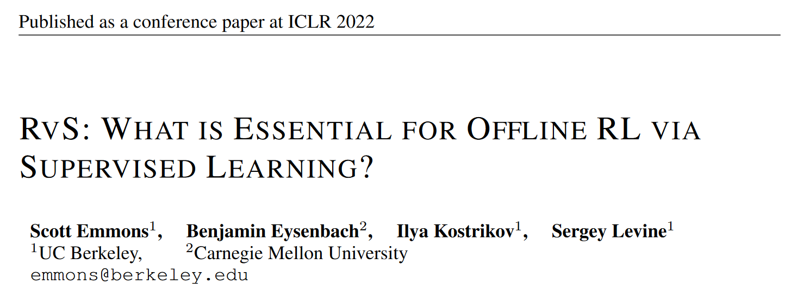

# RvS: What is Essential for Offline RL via Supervised Learning?

- [RvS: What is Essential for Offline RL via Supervised Learning?](#rvs-what-is-essential-for-offline-rl-via-supervised-learning)
  - [Introduction](#introduction)
  - [Reinforcement learning via Supervised learning (RvS)](#reinforcement-learning-via-supervised-learning-rvs)
  - [Model design decisions](#model-design-decisions)

## Introduction 
本文是一篇离线强化学习的技术分析以及调参经验总结文，并没有提出新算法。旨在汇总近年来离线强化学习领域中，一些**只使用监督学习**而**不使用 TD (temporal difference)** 的方法，即他们所总结的 R**einforcement learning via Supervised learning (RvS)**。

本文针对四种离线强化学习数据集和基准，分析 **model capacity (正则、模型框架的选择)** 和 **condition (以 reward 为导向还是以目标为导向)** 对于离线强化学习策略性能的影响。

## Reinforcement learning via Supervised learning (RvS)

RvS 是本文提出用于统一在离线强化学习任务中使用监督学习方法的框架。

1. 首先，定义 MDP：状态 $s_t$， 动作 $a_t$， 初始状态分布$p_s(s_1)$，环境动力学 $p(s_{t+1}|s_t, a_t)$，要学习的动作策略 $\pi_\theta(a_t|s_t)$，经验轨迹 $\tau=(s_1, a_1, r_1, \dots)$，每个 episode 定长 $H$。

2. 上面这些都是基本的定义，针对 RvS 可能会采用不同的 condition，本文定义了一个 $\omega$ 来代替 outcome 的选择（如上图 a），$f(\omega,\tau)$ 就代表轨迹  $\tau$ 出现结果 $\omega$ 的分布。具体来说：

   - 以目标为导向时，outcome $\omega$ 就是一个未来的状态，$f(\omega|\tau_{t:H})=Unif(s_{t+1}, s_{t+2}, \dots, s_H)$ ，这种被称作 **RvS-G**;
   - 以奖励为导向时，outcome $\omega$ 是未来一些 timestep 的平均回报，$f(\omega|\tau_{t:H})=\mathbb{1}(\omega=\dfrac{1}{H-t+1}\sum^H_{t'=t}r(s_{t'}, a_{t'}))$ ，这种被称作 **RvS-R**。

3. 本文关注将这两类 RvS 方法用在离线强化学习中，以经验数据集 $\mathcal{D}={\tau}$ 为输入，通过优化下式寻找以 outcome 为导向的策略 $\pi_\theta(a_t|s_t, \omega)$ 

   

以下给出算法伪码

## Model design decisions

本文采用的网络结构均为两层MLP组成的简单网络，也是旨在探究小模型的 expressivity 是否 enough，以及探讨如 Transformer 这类大模型的必要性。

